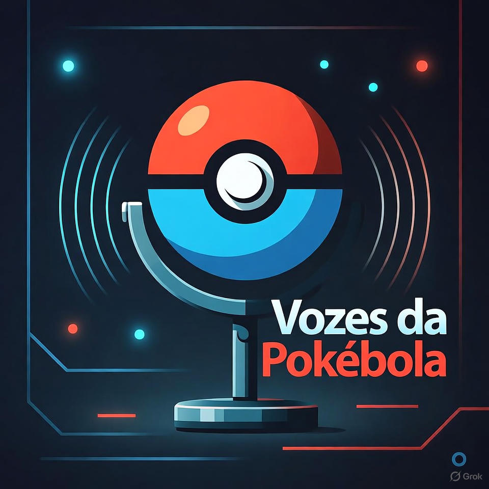

    Preview do podcast. 👇
    <a href="./src/prompts/chatgpt_result.md">Texto do podcast</a>

    <audio src="output/podcast.mp3" controls title="Podcast editado"></audio>

# Projeto Podcast Gerado por I.A.s

 > ℹ️ **NOTE:** Este é o fork de um repositório desenvolvido durante uma live no Youtube em parceria com a [DIO](https://dio.me)

Projeto com o objetivo de gerar um podcast utilizando ferramentas de IA através de prompts mais trabalhado.

Utilizer uma esteira de prompts para gerar cada etapa do processo criativo.

## 💻 Tecnologias utilizadas no projeto

- [ChatGPT](https://chat.openai.com/) 
- [ElevenLabs](https://beta.elevenlabs.io/)
- [Capcut](https://www.capcut.com/pt-br/)
- [Grok](https://grok.com/)

## ✨ Como foi feito ?

- Roteiro gerado via chatgpt
- Audio gerado pela elevenLabs
- Grok para gerar capas
- Capcut para tratar aúdio e adicionar sons de fundo

## 👨‍💻 Expert

    
    
&nbsp&nbsp&nbspNome: Kaka 
    &nbsp&nbsp&nbspCriado por Guilherme Kimura
    

    <a 
        href="https://github.com/satoosan">
        GitHub
    </a>
    &nbsp;|&nbsp;
    <a 
        href="https://www.linkedin.com/in/guisato565/">
        LinkedIn
    </a>

  

---

## 📚 Referências (Feito por Felipe Aguiar)

- [Link da live no Youtube](https://www.youtube.com)
- [Notion Template](https://helpful-jump-17b.notion.site/PAS-Podcast-AI-Studio-210489e15d7a4a73b743bb159e45d06f?pvs=4)
- [Editor de aúdio](https://www.capcut.com/editor?from_page=landing_page&__action_from=picture_V%C3%ADdeos%20profissionais%20em%20minutos,%20n%C3%A3o%20em%20horas.)